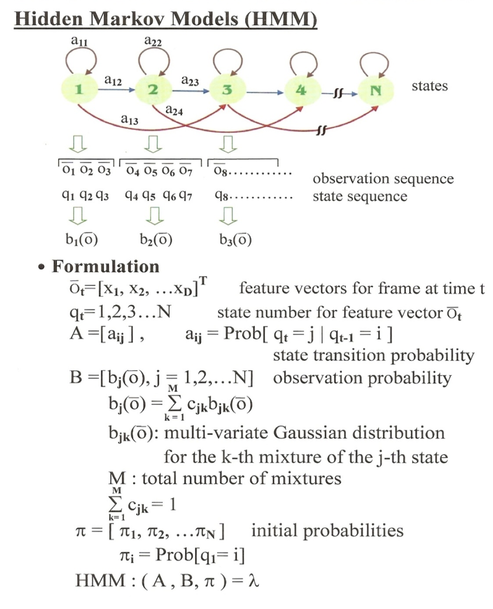
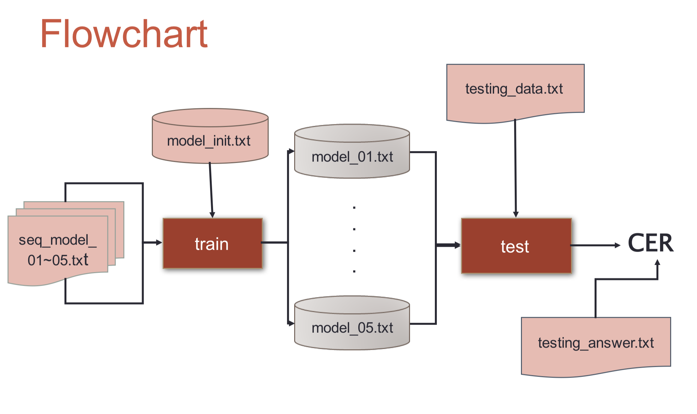
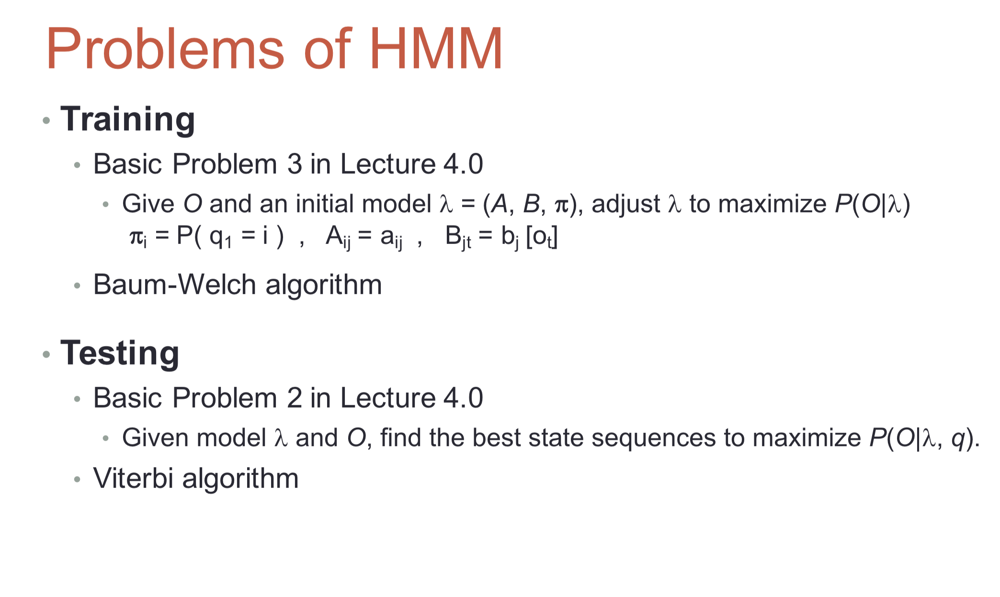
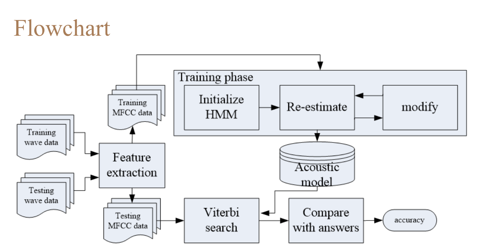

# Digital-Speech-Processing

## Part 1
Topic : Implementing Discrete Hidden Markov Model

### Outline 
- HMM in Speech Recognition 
- Problems of HMM 
    - Training
    - Testing

### Flowchat

## Part 2
Topic : HMM Training and Testing

### Outline
- Hidden Markov Model Toolkit (HTK)

### Flowchart

## Part 3

Goal :
- Build a character-based language model with toolkit SRILM
- Decode the ZhuYin-mixed sequence

